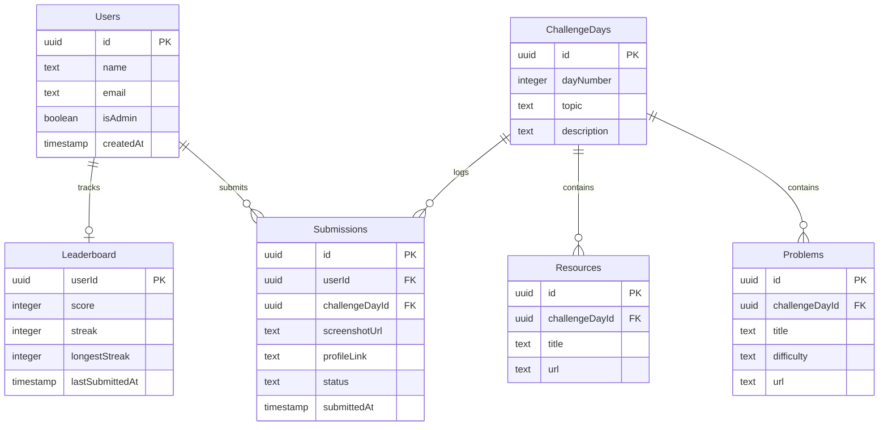

# StreakCode — 21-Day DSA Habit Challenge

StreakCode is a modern, full-stack web application designed to help developers build a daily DSA problem-solving habit through curated curriculums, consistency streaks, visual contribution graphs, and leaderboards.

## Tech Stack
- **Framework**: Next.js 15 (App Router, Server Actions, Turbopack)
- **Language**: TypeScript
- **Styling**: Tailwind CSS v4 & custom developer-focused themes
- **Icons**: Lucide React
- **Database & Auth**: Supabase (PostgreSQL, Row Level Security, Storage, Triggers)

---

## Project Structure
```text
mulearn-dsa-sprint/
├── supabase/
│   └── schema.sql                # Complete database tables, RLS, and streak triggers
├── src/
│   ├── app/
│   │   ├── actions/
│   │   │   ├── admin.ts          # Admin actions (create days, problems, reviews)
│   │   │   ├── auth.ts           # Authentication actions (login, signup, logout)
│   │   │   └── challenge.ts      # User challenge submission action
│   │   ├── admin/
│   │   │   └── page.tsx          # Admin dashboard & review table
│   │   ├── dashboard/
│   │   │   ├── challenge/
│   │   │   │   └── page.tsx      # Daily challenge details & resources
│   │   │   └── page.tsx          # User progress dashboard & 21-day timeline road
│   │   ├── leaderboard/
│   │   │   └── page.tsx          # Podium and top ranking lists
│   │   ├── profile/
│   │   │   └── page.tsx          # Completion stats & GitHub-style activity grid
│   │   ├── login/
│   │   │   └── page.tsx          # Developer-themed login form
│   │   ├── signup/
│   │   │   └── page.tsx          # Developer-themed signup form
│   │   ├── globals.css           # Core theme variables and dot-grid background
│   │   ├── layout.tsx            # App container & server-side Navbar integration
│   │   └── page.tsx              # Minimalist high-fidelity landing page
│   ├── components/
│   │   ├── Navbar.tsx            # Navigation header with active highlight & admin check
│   │   ├── ChallengeSubmissionForm.tsx # Client-side upload & link submission form
│   │   └── AdminFormSection.tsx  # Admin forms to manage days, resources, and problems
│   ├── lib/
│   │   └── utils.ts              # Conditionally merging Tailwind classes (cn helper)
│   └── utils/
│   │   └── supabase/
│   │       ├── client.ts         # Browser-client instantiator
│   │       ├── server.ts         # Server-client instantiator (handles async cookies)
│   │       ├── middleware.ts     # Route guardian & session refresher
│   │       └── user.ts           # Safe server-side user details retriever
│   └── middleware.ts             # Global Next.js route interceptor
```

---

## Database Schema



---

## Installation & Local Setup

### 1. Install Dependencies
If you encounter SSL cipher errors (`ERR_SSL_CIPHER_OPERATION_FAILED`) due to OpenSSL 3 GCM features on modern CPUs/OS configurations, clear the cache and disable hardware acceleration during installation:

```bash
# Clear npm cache
npm cache clean --force

# Install dependencies using the OpenSSL capability workaround
OPENSSL_ia32cap="0" npm install
```

### 2. Configure Environment Variables
Create a `.env` file in the root directory and update the variables with your Supabase project keys:
```env
NEXT_PUBLIC_SUPABASE_URL=https://your-project-id.supabase.co
NEXT_PUBLIC_SUPABASE_ANON_KEY=your-anon-public-api-key
```

### 3. Initialize Supabase Database
Copy and execute the queries in `supabase/schema.sql` inside the **SQL Editor** of your Supabase project dashboard. This will:
1. Create the `users`, `challengedays`, `problems`, `resources`, `submissions`, and `leaderboard` tables.
2. Enable Row Level Security (RLS) policies.
3. Configure the trigger to sync signed-up users to the public profile tables.
4. Setup the trigger to calculate score increases and daily streaks upon submission approvals.

### 4. Create Storage Bucket
In your Supabase Storage dashboard, create a new bucket named **`submissions`** and set its access level to **Public** so screenshots can be fetched inside the dashboard.

### 5. Running the Application
Start the Next.js development server:
```bash
npm run dev
```
Open [http://localhost:3000](http://localhost:3000) to view the application.